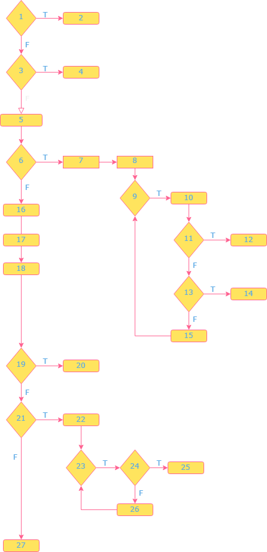

# Втора лабораториска вежба по Софтверско инженерство

## Егзон Ќерими, бр. на индекс 161217

### Control Flow Graph

### Цикломатската комплексност

Формула е:

V(G) = E - N + 2

каде:

E - број на рабови = 28
N - број на јазли = 27

V(G) = 28 - 27 + 2 = 3

Цикломатската комплексност за овој Control Flow Graph е 3.
